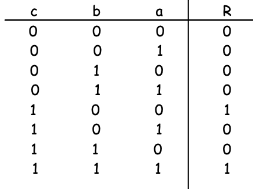
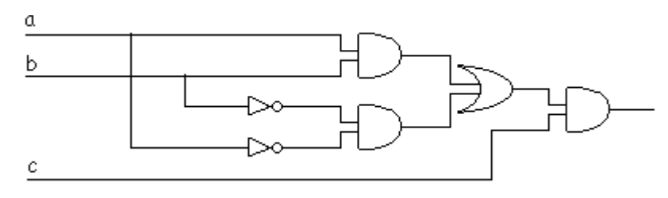

<!-- markdownlint-disable-next-line MD033 MD041 -->

# Universidad Católica del Uruguay

## Programación II

 

# Compuertas Lógicas

## 🤯 Problema

Tu mejor amigo está aprendiendo electrónica y como sabe que tu haces
Informática, pide tu ayuda para que desarrolles un programa que le permita de
manera rápida, evaluar el resultado de un circuito basado compuertas lógicas.

Para apoyarte en la solución del problema, tu amigo te comparte el siguiente
[repositorio](https://github.com/ucudal/PII_PythonToCSharp_Compuertas) donde
tiene una implementación en Python 🐍 de parte del problema.

## Consideraciones

* Para este problema tu amigo te pide que modeles las tres compuertas lógicas
  básicas: `And`, `Or`, `Not`.

* Recuerda que hay compuertas que deben tener al menos dos entradas para poder
  funcionar, pero otras necesitan solo una entrada.

* Ten en cuenta que las compuertas pueden ser conectables unas con otras, es
  decir, como entrada, cada compuerta puede tener o bien el resultado de la
  evaluación parcial del circuito que la precede o un valor lógico.

## 🏋️‍♀️ Desafío

### Parte 1: Diseño

Construye el diagrama de clases de la solución en UML. Puedes usar cualquier
editor de diagramas, ya sea
[Mermaid](https://mermaid.ai/open-source/syntax/classDiagram.html),
[PlantUML](https://plantuml.com/class-diagram) o
[Draw.io](https://app.diagrams.net). También puedes usar papel y lápiz.

### Parte 2: Implementación

Desarrolla el programa utilizando los conceptos que hemos visto hasta el
momento, incluyendo las guías
[Expert](https://github.com/ucudal/PII_Guias/blob/main/Expert.md),
[Polymorphism](https://github.com/ucudal/PII_Guias/blob/main/Polymorphism.md),
[SRP](https://github.com/ucudal/PII_Guias/blob/main/SRP.md) y
[LSP](https://github.com/ucudal/PII_Guias/blob/main/LSP.md).

### Parte 3: Validación

Escribe los casos de prueba para las compuertas implementadas, puedes y debes
apoyarte en las tablas de verdad para cada una de las compuertas lógicas.

### Parte 4: El Garage

Tu amigo luego de un tiempo vuelve a pedirte ayuda, en esta ocasión para
utilizar tu programa en la resolución de un ejercicio un poco mas complejo, el
ejercicio dice así...

Imagina que tienes que diseñar una puerta electrónica para un garaje, de forma
que solo debe abrirse cuando se pulse una determinada combinación de botones
—A, B y C—, según las condiciones indicadas. Diseña el circuito lógico que
permita la apertura de la puerta del garaje, empleando las puertas lógicas que
consideres oportuno.

Condiciones de apertura:

* C pulsado, A y B en reposo.
* A, B y C pulsados.

Para comenzar a darle solución al problema tu amigo realizó el diseño del
circuito y su tabla de verdad.

Para poder ayudarlo tu deberás:

* Implementar una clase GarageGate utilizando las abstracciones antes definidas.
* Realizar los casos de prueba que validen el correcto funcionamiento de la puerta.

## Uso de 

Es posible usar GitHub Copilot en este repositorio. Consulta [cómo usar Copilot
para aprender](./COPILOT.md).
